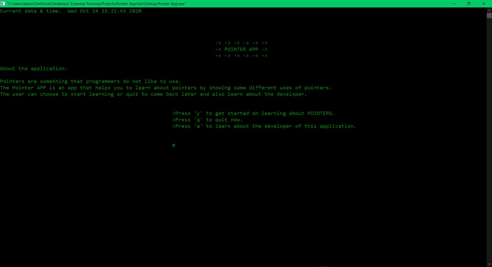
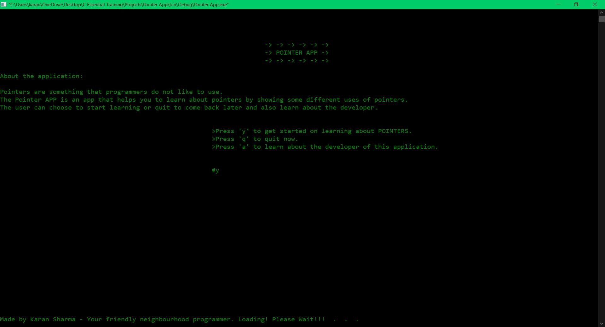
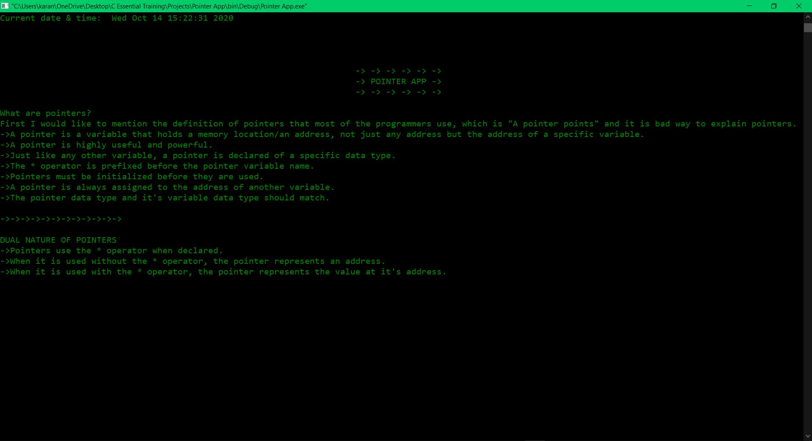
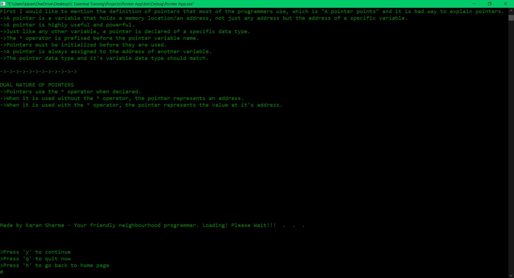
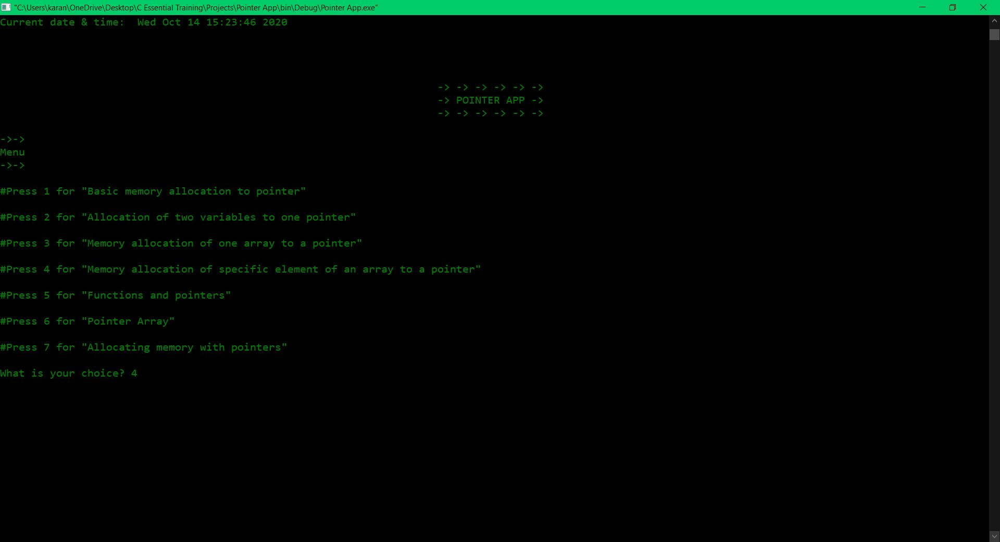
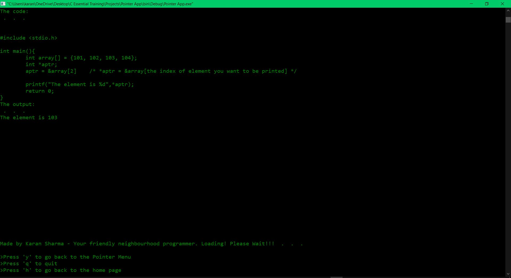
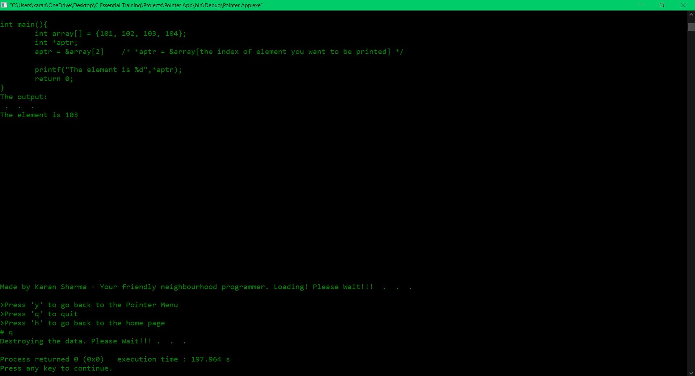

# Pointer_App-C_DEVelopment

Pointer App is a console application on pointers, which shows different uses of pointers.

This is an individual project. This project is an original idea.

This console application is divided into four sections/modules:

Main.c - This file contains the main function and the retry main function. Main function is where the user chooses to start the app, quit the app or learn about the developer. Retry main is the function which is called when the user chooses a wrong option.

Formatting.c - This file contains date_time function, logo function, footer function and the loading function. date_time function is called when a new page is being loaded and it shows system's current date and time. Same goes for logo function which shows the logo of the app, footer function which shows author's name and loading function which shows loading symbol.

Menu.c - This file contains four functions functions - pointers, retryPointers, menu and retryMenu function. pointer function is the first one to be called when user chooses to start the app, this function shows some basic information about pointers. retryPointers is called when user chooses wrong option when prompted for continuing the app, quiting the app or going back to the main page. If the user chooses to continue menu function is called, and it shows seven different options/uses of pointers where user can choose to learn about any of those seven uses of pointers. retryMenu is same as retryPointers.

PointerFunctions.c - This file contains 10 functions - mallocs, pointArray, longest, funcPoint, specificArray, oneArray, twoPointer, basicPointer, aboutMe and retryAboutMe funtion. mallocs-basicPointer functions are seven functions which show different uses of pointers. aboutMe function shows some breif information about the developer of this console application. retryAboutMe function is called when user inputs wrong option when prompted to either quit or go back to main menu from the about me section.

